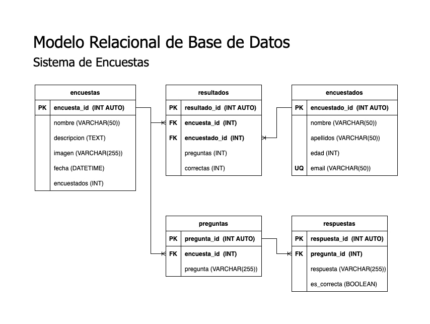

# Encuestas

## Listado de Entidades

### encuestas | **(DE)**

- encuesta_id **(PK)**
- nombre
- descripcion
- imagen
- fecha
- encuestados

### preguntas | **(DE)**

- pregunta_id **(PK)**
- encuesta_id **(FK)**
- pregunta

### respuestas | **(DE)**

- respuesta_id **(PK)**
- pregunta_id **(FK)**
- respuesta
- es_correcta

### encuestados | **(DE)**

- encuestado_id **(PK)**
- nombre
- apellido
- edad
- email **(UQ)**

### resuldados | **(PE)**

- resultado_id **(PK)**
- encuesta_id **(FK)**
- encuestado_id **(FK)**
- preguntas
- correctas

---

## Relaciones

1. Una **encuesta** puede tener varias **preguntas** (_1 a M_)
1. Una **pregunta** puede tener varias **respuestas** (_1 a M_)
1. Una **encuesta** puede tener varios **resultados** (_1 a M_)
1. Un **encuestado** puede tener varios **resultados** (_1 a M_)

---

## Modelo Relacional de la BD

