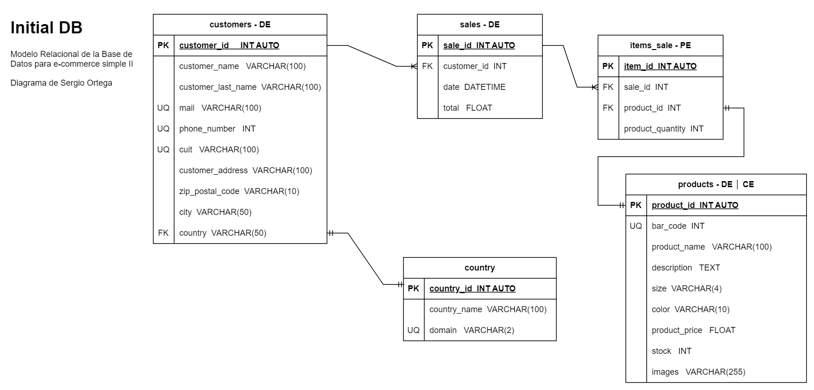

# Ventas

## Listado de Entidades

### customers - **(DE)**

- customer_id INT AUTO **(PK)**
- customer_name VARCHAR(100)
- customer_last_name VARCHAR(100)
- email VARCHAR(100) **(UQ)**
- phone_number INT **(UQ)**
- cuil VARCHAR(100) **(UQ)**
- customer_address VARCHAR(100)
- zip_postal_code VARCHAR(10)
- city VARCHAR(500)
- country VARCHAR(50) **(FK)**

### products - **(DE|CE)**

- product_id INT AUTO **(PK)**
- bar_code INT
- product_name VARCHAR(100)
- description TEXT
- size VARCHAR(4)
- color VARCHAR(10)
- product_price FLOAT
- stock INT
- image VARCHAR(250)

### sales - **(DE)**

- sale_id INT AUTO **(PK)**
- customer_id INT **(FK)**
- date DATETIME
- total FLOAT

### items_sale - **(PE)**

- item_id INT AUTO **(PK)**
- sale_id INT **(FK)**
- product_id INT **(FK)**
- product_quantity INT

### country - **(CE)**

- country_id INT AUTO **(PK)**
- country_name VARCHAR(50)
- domain VARCHAR(2) **(UQ)**

---

## Relaciones

1. Un **customer** tiene **country** (_1 - 1_)
1. Un **customers** puede tener varias **sales** (_1 - M_)
1. Un **sales** puede tener varias **items_sale** (_1 - M_)
   1.Un **items_sale** es un **procuct** (_1 - 1_)

---

## Modelo Relacional de la DB

---

## Reglas de negocio

### Para todas las entidades

1. Crear un cliente/producto/venta/item/pais
1. Leer un cliente/producto/venta/item/pais
1. Leer todos los cliente/producto/venta/item/pais
1. Modificar un cliente/producto/venta/item/pais
1. Borrar un cliente/producto/venta/item/pais

### Para la entidad product

1. En cada venta restar los productos involucrados a su stock

### Para la entidad sales

1. Leer las ventas de un producto
1. Leer las ventas de un cliente

### Para la entidad item

1. Leer los items de un producto
1. Leer los items de un cliente

---
